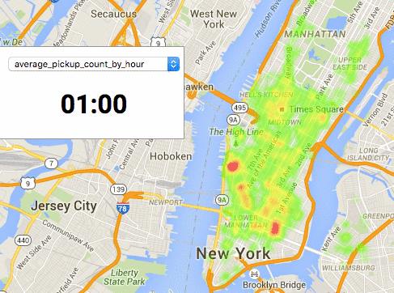
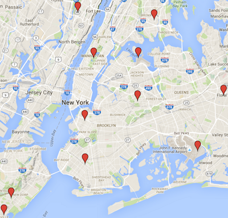
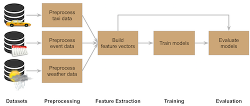
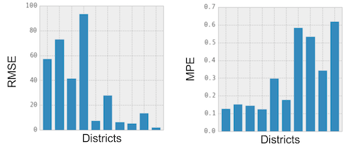
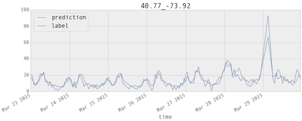
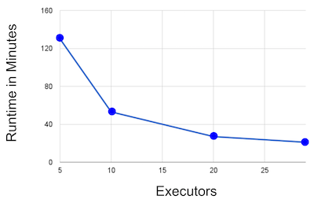
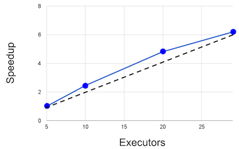

# MMDS-sose16

As part of the "Mining Massive Datasets" Seminar of the [HPI](http://hpi.de/), this project implements a prediction system for taxi pickups in New York City.
We used the [TLC Trip Record Data](http://www.nyc.gov/html/tlc/html/about/trip_record_data.shtml), as well as weather and event datasets, to train regression models using [Apache Spark](http://spark.apache.org/).

In this document, we will describe the datasets we used, our implementation, and our results.
If you simply want to get started, skip to the [Getting Started](#getting_started) section of this document.

## Datasets

In this section, we present the dataset used for training hour system.

### TLC Trip Record Datato

The [TLC Trip Record Dataset](http://www.nyc.gov/html/tlc/html/about/trip_record_data.shtml) contains the taxi rides in NYC from 2009 to 2015.
The provided information includes the start & end times as well as start & end locations.

You can find some basic statistics in our [taxi statistics notebook](notebooks/taxi_statistics.ipynb).
Furthermore, we plotted heatmaps of the pickup frequencies using our [Heatmap Visualizer](heatmap-visualizer).
The following shows a heatmap of the average pickup frequency by hour:



### Weather Dataset

The [NOAA Daily Summaries Dataset](http://www.ncdc.noaa.gov/cdo-web/datasets) contains daily weather summaries of 11 station in and around NYC from 2009 to 2015. The weather stations are distributed around NYC as follows:



The information includes:

- Precipitation
- Min/Max temperature
- Wind speed

You can find visualisations of basic statistics of this dataset in our [statistics notebook](notebooks/weather_statistics.ipynb). 

We initally also took the *NOAA Hourly Precipitation* dataset into account, but since it is highly incomplete and has many missing values (as shown in the notebook), we did not use it for the project. 

### Event Dataset

TODO(fabian, soeren)

## Implementation

Our training pipeline consists of several stages, illustrated in the following graphic:



We'll go into detail about all the stages in the following sections.

### Preprocessing

There were three general goals of preprocessing of our datasets. First, time and coordinate values get discretized. For the time, we confine ourselves on hours, so minutes and seconds get discarded. Further on, we divided NYC into districts of a grid by rounding latitude and longitude values to two decimal places.

Second, we do some simple data cleansing and standardization. Outliers and invalid data are removed and different time formats are parsed into a common one. 

Finally, the datasets get transformed into a similar base schema, which makes it easier to join the three preprocessed datasets together at the end when building the feature vectors. 

We developed a preprocessing script for each of the three datasets, which can be found in the [spark-scripts/preprocessing](spark-scripts/preprocessing/) directory.

#### Taxi Dataset

The original taxi datasets contains a single row per taxi trip including pickup and dropoff coordinates and times. We had to accumulate the pickups and dropoffs, so that in the preprocessed dataset for each district and hour the number of pickups and dropoffs is stored. 

#### Weather Dataset

The original weather dataset has one row per station and day in the time period. To match the base schema, we had to transpose the weather stations from rows to columns, so that for each day the preprocessed dataset contains the four measurement columns (precipitation, min/max temperature, average wind speed) for each of the 11 weather stations. 

Additionally, missing values are a problem in the original dataset. There are days, on which some stations do not provide all measurements. In this instance, we take the average of the measurements from the three nearest stations, which have a value for that day. In the rare case that no station at all has a measurement, we take the average over the complete time period as value.

#### Event Dataset

Similar to the taxi data, the event dataset needs to get accumulated, since it contains one row per event. The resulting dataset contains a vector for each hour in the time period, which has an entry for each venue in the dataset. This vector stores the number of events taking place at the particular venues in the respective hour. 

We are using this vector implementation instead of having a column per venue to decrease the memory consumption. For one thing, we do not have the memory overhead of storing metadata like the data type for each column. For another thing, we are using sparse vectors which saves a lot of memory because there are only a few events happening at the same time in the dataset. 

### Feature Extraction

TODO(fabian)

- One model per district
- discretization

### Training

Using our features from the previous section, we trained two kinds regression models: A linear regeression and a random forest regression model.
Since we are training one model per district, we trained multiple models for each of the two.

#### Linear Regression

A linear regression model attempts to predict the target values by finding weights such that the prediction is computed as a weighted sum of the feature vector entries.
Because linear regression models treat all features as numeric features, we use one-hot encoding for categorical features for these models.

The Model is then trained with Stochastic Gradient Descent, using Spark's `LinearRegressionWithSGD` class.
The implementation can be found in the [`linear_regression.py`](spark-scripts/training/linear_regression.py) script.
The main parameters of this method are the learning rate (called `step` in The Spark API) and the number of iterations.

We tried several different learning rates and iterations.
However, we found that our best linear regression result was significantly outperformed by our best random forest result (RMSE of ~33 vs. RMSE of ~62).
For this reason, we focused on the random forest model for further experiments.

#### Random Forest

A random forest model builds a number of (binary) decision trees for regression and combines their predictions at prediction time.
These models can naturally deal with categorical data.
Therefore, we do not perform one-hot encoding on our categorical features, and instead pass those features directly to the model.

The random forest is implemented using Spark's `RandomForest.trainRegressor()` method in our [`random_forest.py`](spark-scripts/training/random_forest.py) script.
The main parameters include the number of trees to use and the maximum tree depth.

##### Random Forest Experiments

Our first baseline model was trained with 5 trees and a maximum depth of 15. To improve the accuracy of the model, we tested different training parameters and compared the average RMSE. All of the experiments were executed on AWS using 10 *r3.large* executors with 2 cores and 15GB RAM each. We did the training for 10 districts and calculated the average RMSE for comparison. 

The results are shown in the following table. The first row is the baseline. For the other experiments, we also calculated the percentual change of the RMSE regarding the baseline.

| Number of trees | Maximum depth | Training time (hours) | Average RMSE | Average RMSE change |
|-----------------|---------------|-----------------------|--------------|---------------------|
| 5               | 15            | 08:24                 | 32.7193      | *n/a*               |
| 10              | 17            | 24:39                 | 32.8164      | +0.31%              |
| 10              | 10            | 04:06                 | 31.2672      | -4.43%              |
| 20              | 10            | 05:06                 | 32.1055      | -1.86%              |

The first thing we did was to increase the complexity of the model by incrementing the number of trees and maximum depth. The result was a slightly raise of the error. Since this experiment was not successful and to prevent overfitting, we lowered the maximum depth to 10, which resulted in an error improvement by 4.43% regarding the baseline. We assumed that some important features were not used for splits in the decision trees, because the feature vector contains a large number of features and the trained models are rather small. Therefore, we kept the depth of 10, but increased the number of trees to 20 in the last experiment. Unfortunately, the assumption was not correct, since the error was larger than in the previous experiment. 

Since the errors did not really changed much among the different experiments, it was hard for us to determine, which parameters are suitable for training. Also our time and budget was limited, so the model with 10 trees and a maximum depth of 10 is the best one we could accomplish in the project.

##### Random Forest Model Analysis

In order to better understand our random forest models, we performed an analysis on one of the models we trained.

For this, we looked at all features and computed an *importance score* as follows:
We define the *node value* of a decision tree node to be *2<sup>-level</sup>*.
Assuming that each node splits the data in half, this node fraction corresponds to the fraction of data that is affected by the decision made in this node.
The *importance score* of a feature is then the sum of all node values where the feature is used.

According to this score, these are the 20 most important features with their corresponding score:

```
[('Pickup_Count_Nb_1h', 4.7470703125),
 ('Pickup_Count_Dis_1h', 4.1552734375),
 ('Pickup_Count_Nyc_4h', 2.3056640625),
 ('Pickup_Count_Nyc_1h', 1.87109375),
 ('Hour', 1.8310546875),
 ('Dropoff_Count_Nyc_4h', 1.4365234375),
 ('Pickup_Count_Nb_4h', 1.4033203125),
 ('Dropoff_Count_Nyc_1h', 1.2607421875),
 ('Pickup_Count_Dis_4h', 1.2177734375),
 ('Dropoff_Count_Nb_4h', 1.0439453125),
 ('Day_Of_Week', 1.0185546875),
 ('Dropoff_Count_Dis_4h', 0.8076171875),
 ('IsHoliday', 0.7763671875),
 ('Day_Of_Year', 0.7158203125),
 ('Dropoff_Count_Dis_1h', 0.57421875),
 ('Dropoff_Count_Nb_1h', 0.3056640625),
 ('Venue 1972 (-3)', 0.2568359375),
 ('AWND_GHCND:US1NJBG0018', 0.244140625),  # (this is a weather feature)
 ('Venue 428 (-2)', 0.1328125),
 ('Venue 1755 (-3)', 0.072265625)]
```

The full analysis can be found in our [`analyze_random_forest`](notebooks/analyze_random_forest.ipynb) notebook.


### Evaluation Pipeline

For all evaluations (including those mentioned in the training section), we our data into training data (everything before 2015) and evaluation data (all of 2015).
This split simulates the scenario where we do have ground-truth data for the past to train models that perform well in the future.

Because training on all districts for all experiments would have been too time-consuming, we used 10 evaluation districts.
These have been sampled from the top 200 districts in terms of pickup frequency.
All of them are in or close to Manhattan, as can be seen in this map:


For evaluation, we report two error measures:

- **Root-Mean-Square Error (RMSE)**: The root of the mean of *error<sup>2</sup>*
- **Mean Proportional Error (MPE)**: The mean of *|error| / actual*

## Results

Our evaluation consists of two parts:
First, we evaluate the model quality.
Second, we evaluate the scalability of our approach.

### Model Evaluation

In general, we observed that our random forest models performed much better than the best linear regression models (RMSE ~33 vs. ~62, averaged over all evaluation districts).
We also found that the Stochastic Gradient Descent training was less stable than the random forest training.
For these reason, we will focus on the random forest models in this section.

The following plots show the RMSE and MPE values of the random forest models for the evaluation districts, using 5 trees with a maximum depth of 15:



It becomes clear that generally the variance of these values is quite high.
The average RMSE is 33 with a standard deviation of 32.
The average MPE is 31% with a standard deviation of 20%.

Also, the two error measures seem to complement each other, which can be explained by the different scales of the pickup frequencies among the districts:
If pickup frequency is low, it is easy to achive a low RMSE value, but harder to perform well on the MPE measure.
The opposite is true for high frequency districts.

However, if predicted & actual values are plotted side-by-side, one can see that the prediction curve quite accurately tracks the actual curve.
The following chart shows a typical week of one of the districts.



A more detailed evaluation, including more prediction-vs-actual plots can be found in our [`model_evaluation`](notebooks/model_evaluation.ipynb) notebook.

### Scale-out Experiments

The first point we would like to make wih regard to scalability ist that we think of our approach as inherently scalable:
Since we train one model per district and all models can be trained independently of one another, we can achieve a linear scale-up simply by training hundreds of models in parallel.
Nevertheless, we tested the scalability of our random forest training by doing scale-out experiments.

For this, we used [Amazon Web Services](https://aws.amazon.com/) EC2 in conjunction with the [spark-ec2](http://spark.apache.org/docs/latest/ec2-scripts.html) script to spin up the machines and provision the cluster.
We used the *r3.large* instance type, which has two cores and around 15GB of main memory.

By varying the number of executors and measuring the training time for one model (i.e., one district), we obtained the following runtime chart:



In the speedup chart (all runtimes divided by the runtime of five nodes), we observe that our speedup is superlinear initially and then flattens:



We conclude that optimal number of executors for hour task is between 10 and 20 nodes.

## <a name="getting_started"></a> Getting Started

Start by installing the necessary requirements:

```bash
pip install -r requirements.txt
```

Next, you can look into different parts of this project.
You can find detailed instructions in the READMEs of each of these directories.
Here is an overview of the most relevant directories:

- [`heatmap-visualizer`](heatmap-visualizer): A small tool that uses the Google Maps API to generate (animated) heatmaps from a simple JSON-based file format.
- [`notebooks`](notebooks): Our collection of Jupyter Notebooks. Contains dataset statistics and a model analysis.
- [`scripts`](scripts): A collection of bash/python scripts to crawl, download & sample our datasets.
- [`spark-scripts`](spark-scripts): All of our spark jobs. The directory is organized by stages of our pipeline (contains `preprocessing`, `training` and `evaluation` subdirectories).
